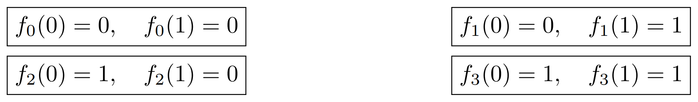

# Deutsch’s Algorithm
## Deutsch’s problem
Let f : {0, 1} → {0, 1} be a one bit Boolean function. There exists only four different functions mapping bits to bits:

Notice that, although bit-to-bit functions are “simple”, they might be very hard to compute.

# **Deutsch's Problem and Query Complexity**  

## **Overview**  
Deutsch's problem is a fundamental problem in quantum computing, formulated as follows:  

> Given an oracle that computes a function **f: {0,1} → {0,1}**, determine whether the function is **constant** or **balanced**.  

- A **constant function** satisfies **f(0) = f(1)**.  
- A **balanced function** satisfies **f(0) ≠ f(1)**.  

From mathematical analysis, we observe that certain functions (e.g., **f₀ and f₃**) are constant, while others (**f₁ and f₂**) are balanced.  

## **Query Complexity**  
The complexity of solving Deutsch’s problem is measured in terms of the **number of queries** required to the oracle in the **worst-case scenario**. This is known as **query complexity**.  

Imagine an oracle as an **old wise sage on top of a high mountain**. Each time we seek an answer, we must hike up the mountain to ask a single question. Since this journey is extremely difficult, the focus is on minimizing the number of queries, as any pre-processing or post-processing steps are considered negligible in comparison.  

### **Classical Query Complexity**  
If we are given an oracle that takes **i ∈ {0,1}** as input and outputs **f(i) ∈ {0,1}**, how many queries do we need to determine whether **f** is constant or balanced?  

1. If we only query the oracle once (e.g., checking **f(0)**), we **cannot** determine whether the function is constant or balanced.
2. To be certain, we must **query twice** (checking both **f(0) and f(1)**). If **f(0) = f(1)**, the function is constant; otherwise, it is balanced.  

Thus, the **classical query complexity of Deutsch’s problem is two**.  

## **Quantum Advantage**  
Using **quantum computing**, Deutsch’s problem can be solved with just **one query** instead of two. This is achieved through quantum superposition and interference, forming the basis for the **Deutsch-Josza algorithm**, which extends this concept to more complex functions.  

---  
This repository contains an **implementation of Deutsch’s algorithm using Qiskit**, demonstrating the power of quantum computing in reducing query complexity.  

